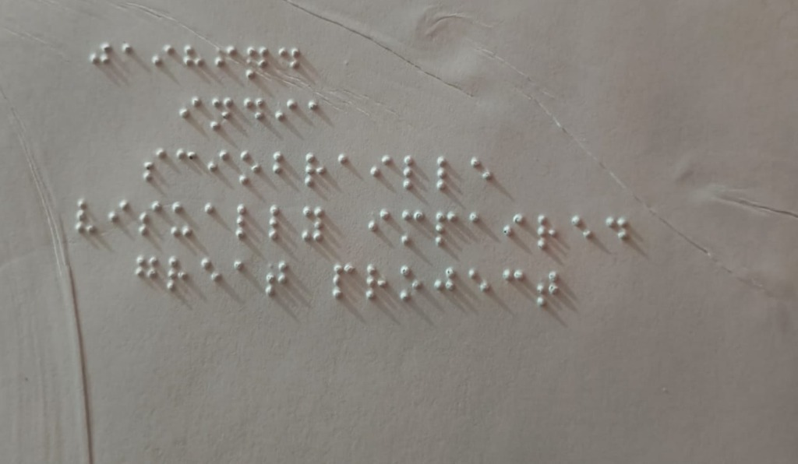
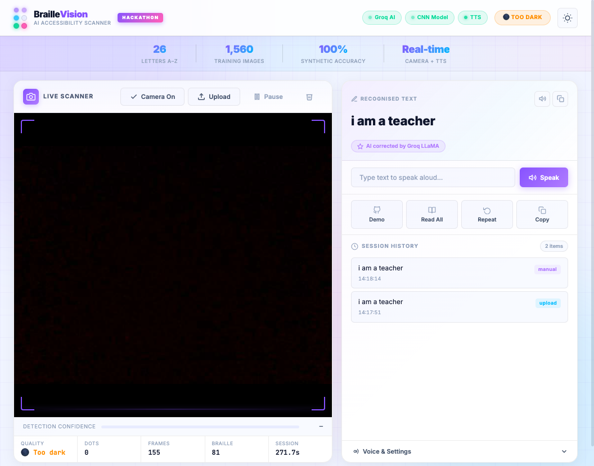
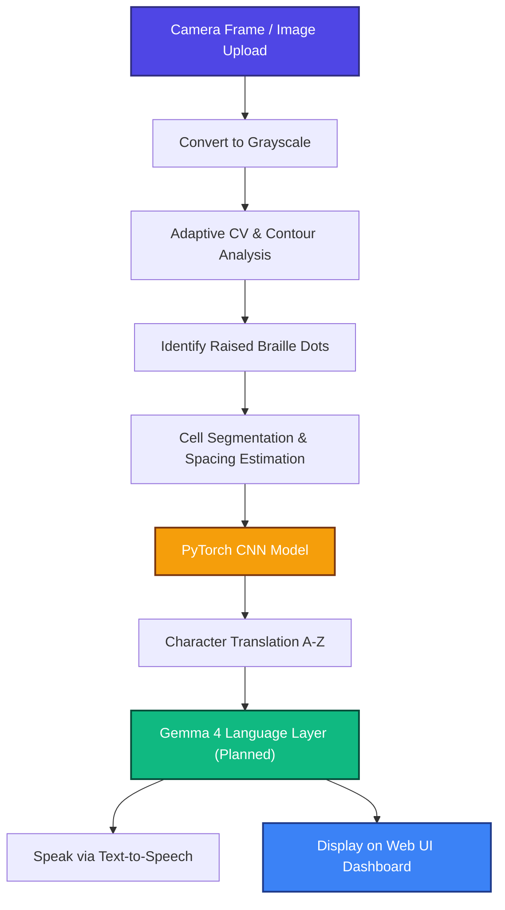

# 👁️ Braille Vision — AI Accessibility Scanner

> **Real-time Braille OCR with CNN recognition, multilingual accessibility workflows, and future Gemma 4 language intelligence.**  
> Built for accessibility. Powered by a **custom synthetic dataset**, PyTorch, and planned Gemma language intelligence.

<p align="center">
  
  
  
  
  
</p>

---

# Gemma 4 Integration Roadmap

Braille Vision is actively evolving toward integrating **Gemma 4** as its core language intelligence layer. While our current release successfully delivers real-time computer vision dot detection, PyTorch CNN character recognition, and Text-to-Speech synthesis, Gemma 4 is planned to power advanced natural language understanding, multilingual translation, and error correction for visually impaired users.

| Capability | Status |
| :--- | :--- |
| Braille Detection | Implemented |
| CNN Character Recognition | Implemented |
| Text-to-Speech | Implemented |
| Gemma OCR Error Correction | Planned |
| Gemma Translation (English ↔ Bengali/Hindi) | Planned |
| Gemma Content Simplification | Planned |
| Gemma Accessibility Assistant | Planned |

> **Note:** Gemma 4 integration described in this document represents the planned roadmap of the project. Current releases focus on Braille detection, OCR, and accessibility features. Gemma-powered capabilities are under active development.

---

## 📸 Pipeline Showcase

This visual pipeline demonstrates **Braille Vision** detecting, transcribing, and speaking real Braille.

| 📥 1. Raw Braille Paper | ⚙️ 2. Web UI (Waiting State) | 📤 3. OCR & AI Transcription |
| :---: | :---: | :---: |
|  |  |  |
| **Physical Braille paper** ([public/test_jaihind.jpg](file:///Users/ayush/Braiile-Vision/public/test_jaihind.jpg)) featuring raised dots. | **Modern dark theme** scanner dashboard waiting for camera stream or file upload. | **Real-time output overlay** with localized dots, characters, and text history. |

---

## Current Features

* **Adaptive Dot Detection:** Handles shadows, perspective shifts, and slight camera rotations.
* **Custom CNN Classifier:** Low-latency PyTorch model running locally on the server.
* **Instant Text-to-Speech:** Integrated TTS reads out recognized text using macOS or web fallbacks.
* **Keyboard-First Interface:** Responsive design with extensive shortcuts for keyboard and screen reader accessibility.

---

## Planned Gemma Features

* OCR error correction using Gemma 4
* Translation into Bengali, Hindi, and other regional languages
* Accessibility-focused content simplification
* Context-aware sentence reconstruction
* Conversational accessibility assistant

---

## Build with Gemma Vision

Braille Vision aims to use Gemma 4 as an accessibility intelligence layer that transforms raw Braille recognition into understandable, translatable, and voice-enabled content for visually impaired users.

This planned integration aligns directly with key hackathon themes and tracks:

* **Local Language & Inclusion Track:** Breaking down language barriers by bridging English Braille transcription with regional spoken and written languages.
* **Accessibility:** Empowering visually impaired individuals by converting static, tactile Braille into dynamic, spoken, and interactive digital text.
* **Multilingual support:** Planned translation pipelines for Bengali, Hindi, and other regional languages to ensure broad inclusivity.
* **Education and information access:** Facilitating easier learning and document comprehension through context-aware sentence reconstruction and content simplification.

---

## ⚙️ How it Works



### Gemma 4 Language Layer (Planned)

The language processing pipeline is designed to transition from basic transcription to an intelligent, context-aware accessibility layer powered by Gemma 4. This upcoming stage will handle:

* **OCR error correction:** Contextually correcting misclassified Braille characters from noisy image scans.
* **Sentence reconstruction:** Restoring natural grammatical flow and coherence to transcribed cells.
* **Multilingual translation:** Translating English text into regional languages such as Bengali, Hindi, and more.
* **Accessibility-focused summarization:** Condensing long or complex Braille documents into easy-to-understand summaries.
* **Natural language interaction:** Enabling conversational follow-up questions and voice-guided assistance.

Gemma integration is currently under development and is part of the project's future roadmap.

---

## 📊 Dataset & Model Architecture

The custom convolutional neural network (CNN) at the core of this system was trained on a synthetic Braille dataset built from scratch:

| Dataset / Model Attribute | Specifications & Files |
| :--- | :--- |
| **Images Count** | 1,560 images (26 letters × 60 variations) |
| **Augmentation Techniques** | Position jitter, rotation, Gaussian blur, scaling |
| **Generator Script** | [generate_dataset.py](file:///Users/ayush/Braiile-Vision/synthetic_dataset/scripts/generate_dataset.py) |
| **Training Pipeline** | [train_model.py](file:///Users/ayush/Braiile-Vision/synthetic_dataset/scripts/train_model.py) |
| **Model Weights File** | [braille_cnn.pth](file:///Users/ayush/Braiile-Vision/synthetic_dataset/models/braille_cnn.pth) (~8 MB) |

### CNN Neural Network Architecture
```
64×64 grayscale cell
  → Conv2d(1→32) + ReLU + MaxPool
  → Conv2d(32→64) + ReLU + MaxPool
  → Linear (Fully Connected) → 26 output classes (A–Z)
```

To regenerate the dataset and run the training pipeline locally:
```bash
python3 synthetic_dataset/scripts/generate_dataset.py
python3 synthetic_dataset/scripts/train_model.py
```

---

## 🚀 Run Locally

### Prerequisites
* **Python 3.9+** (3.11 recommended)
* Optional: [Groq API Key](https://console.groq.com) for LLaMA grammatical correction

### Quick Setup Steps

1. **Clone the Repository**
   ```bash
   git clone https://github.com/atuljha-tech/Braiile-Vision.git
   cd Braiile-Vision
   ```

2. **Initialize Virtual Environment**
   ```bash
   python3 -m venv venv
   source venv/bin/activate  # Windows: venv\Scripts\activate
   ```

3. **Install Dependencies**
   ```bash
   pip install -r requirements.txt
   ```

4. **Environment Variables Config**
   Copy the example environment configuration and edit it to add your Groq API Key:
   ```bash
   cp .env.example .env
   # Edit .env and set GROQ_API_KEY=gsk_...
   ```

5. **Start Flask Server**
   ```bash
   python3 app.py
   ```
   Open **http://localhost:5050** in your browser. Chrome or Edge are recommended for camera permissions.

### Quick Health Check
```bash
curl http://localhost:5050/api/health
# Response: {"status":"ok","cnn":true,"groq":true|false,...}
```

---

## ☁️ Deploy on Render

Deploy the Flask application server, computer vision pipelines, and PyTorch models seamlessly on Render.

### Step-by-Step Deployment Instructions

1. **Sign in to Render:** Go to [dashboard.render.com](https://dashboard.render.com) and sign in using your GitHub account.
2. **Create Web Service:** Click **New +** → **Web Service** and connect the `Braiile-Vision` repository.
3. **Configure Settings:** Use the following configuration parameters on the creation screen:

| Field | Value |
| :--- | :--- |
| **Name** | `braille-vision` |
| **Region** | Choose the server closest to you |
| **Branch** | `main` |
| **Runtime** | **Python 3** |
| **Build Command** | `bash build.sh` |
| **Start Command** | `gunicorn app:app -c gunicorn.conf.py` |
| **Instance Type** | **Free** (or any paid instance for cold start bypass) |

4. **Configure Environment Variables:** Add the following environment variables in the environment settings section:

| Key | Value | Description |
| :--- | :--- | :--- |
| `PYTHON_VERSION` | `3.11.9` | Specific Python engine version |
| `GROQ_API_KEY` | `your_groq_api_key` | Optional API key for LLM correction |
| `DISABLE_SERVER_TTS` | `1` | Server-side TTS bypass (client-side browser TTS will handle speech) |
| `OMP_NUM_THREADS` | `1` | CPU resource governor limit for optimal memory usage on Free tier |

5. **Deploy & Validate:** Click **Create Web Service**. Build process takes roughly **5-15 minutes** (as PyTorch is installed). Once status is **Live**, visit your Render URL (e.g. `https://braille-vision.onrender.com/api/health`).

---

## 🛠️ Troubleshooting on Render

| Issue | Root Cause | Resolution |
| :--- | :--- | :--- |
| **Build timeout / Out of Memory** | Free Tier resource caps | Ensure your build command uses [build.sh](file:///Users/ayush/Braiile-Vision/build.sh) which installs a CPU-only PyTorch build. |
| **`Exited with status 1` on deploy** | Incorrect startup script | Start command must use `gunicorn app:app -c gunicorn.conf.py`. |
| **ModuleNotFoundError** | Missing dependencies | Confirm that your Build Command is correctly pointed to `bash build.sh`. |
| **Groq integration errors** | Groq client deprecations | Ensure you set `GROQ_API_KEY` environment variable. The repo utilizes updated `groq>=0.13` bindings. |
| **No audio/voice output** | Web environment sandbox | Expected — Speech is spoken from your client browser tab via Web Speech API. Allow permissions. |

---

## 🎥 Recording a Video Demo

### 1. Preparations
* Launch the application locally at `http://localhost:5050` or open your live Render URL.
* Zoom browser window to 100% and maximize the layout.
* Keep [public/test_jaihind.jpg](file:///Users/ayush/Braiile-Vision/public/test_jaihind.jpg) ready to upload.
* Turn on a screen recorder of choice (e.g., QuickTime on macOS, OBS, or Snipping Tool on Windows).

### 2. Suggested 2-Minute Script Outline

| Timestamp | Screen Interaction | Narrative Script / Speech |
| :--- | :--- | :--- |
| **0:00 - 0:15** | App home page, dashboard header | *"This is Braille Vision — an AI accessibility scanner that reads Braille from images and camera."* |
| **0:15 - 0:25** | Point to model status indicators | *"It utilizes a CNN trained on a custom synthetic dataset, with planned Gemma 4 integration for language intelligence."* |
| **0:25 - 0:55** | Upload [public/test_jaihind.jpg](file:///Users/ayush/Braiile-Vision/public/test_jaihind.jpg) | *"I upload a Braille sample page; the system instantly locates dots, structures them, and runs cell classification."* |
| **0:55 - 1:10** | Show history log / click TTS button | *"We get live output, visual outlines, confidence statistics, history tracking, and Text-to-Speech feedback."* |
| **1:10 - 1:25** | Toggle theme switcher | *"The interface supports high-contrast dark and light modes optimized for various accessibility needs."* |
| **1:25 - 1:45** | Click "Allow Camera" & test live feed | *"For physical setups, users can activate a live webcam scanner reading Braille directly in real-time."* |
| **1:45 - 2:00** | GitHub repo and conclusion | *"The code is fully open-source. Links are in the description. Thank you."* |

---

## 📂 Project Structure

```
├── app.py                    # Flask application entry point
├── Procfile                  # Procfile for Render/Heroku deployments
├── render.yaml               # Infrastructure as Code blueprint
├── public/                   # Public static media and documentation screenshots
│   ├── test_jaihind.jpg      # Reference test Braille plate photo
│   ├── ss1.png               # Active transcription UI screenshot
│   └── ss2.png               # Idle scanner dashboard screenshot
├── braille_ocr/              # Geometric CV & dot localization pipeline
│   ├── realtime/             # Stream processing, camera, and speech hooks
│   └── core/                 # Core image segmentation and spacing decoders
├── braille_ai/               # AI inference models (CNN predictor & Groq API client)
├── synthetic_dataset/        # Training dataset generator scripts and PyTorch modules
├── templates/ + static/      # HTML templates and UI assets
└── requirements.txt          # Python dependency index
```

---

## 🔌 API Endpoints Summary

| Method | Endpoint | Description |
| :--- | :--- | :--- |
| **GET** | `/` | Renders the primary dashboard web UI |
| **GET** | `/api/health` | Service health status check |
| **GET** | `/api/status` | Current computer vision model/API setup details |
| **POST** | `/api/upload` | Process static image files uploaded by users |
| **POST** | `/api/process_frame` | Process incoming raw base64 frame from live webcams |
| **POST** | `/api/speak` | Server-side text synthesis payload endpoint |

---

## ⌨️ Dashboard Keyboard Shortcuts

| Shortcut Key | Action |
| :---: | :--- |
| <kbd>Space</kbd> | Pause or resume live camera analysis |
| <kbd>R</kbd> | Repeat audio narration of the last recognized sentence |
| <kbd>H</kbd> | Read history log readout aloud |
| <kbd>C</kbd> | Copy recognized text to system clipboard |
| <kbd>U</kbd> | Direct trigger for manual file upload dialog |
| <kbd>D</kbd> | Auto-run pipeline using demo assets |

---

### Future Work

* Gemma-powered translation
* Gemma-powered educational explanations
* Offline Gemma inference
* Regional language accessibility
* Document understanding
* Voice-based accessibility assistant

---

## 📄 License

This project is licensed under the MIT License — see the [LICENSE](LICENSE) file for details.

*Built with care for accessibility. Every person deserves to read.*
